# Examining the Impact of Generative AI on Undergraduate Academic Performance Across Disciplines at UCSD

## Introduction
With the rapid advancements in generative AI technologies like OpenAI's ChatGPT, the educational landscape is undergoing significant transformations. This project aims to examine the impact of these AI tools on undergraduate academic performance at UC San Diego by analyzing the distributions of average grades received before and after their introduction. By focusing on both Arts and STEM disciplines, we seek to uncover any possible trends or disparities in academic outcomes. The relevance of this study lies in its potential to guide educators, policymakers, and technology developers in ethically integrating AI into educational environments. By analyzing data from UCSD's Course and Professor Evaluations (CAPE) database, we hope to provide valuable insights into the evolving role of AI in higher education.

## Data
### Data Source
The primary data source for this project is the Course and Professor Evaluations (CAPE) database, a student-run organization that administers standardized evaluations of UCSD's undergraduate courses and professors. CAPE collects student feedback to gauge the quality of the University's curriculum and faculty, providing insights into the opinions of students on specific courses and professors.

To acquire the data, we followed CAPE's recommendation to download the webpage and extract data directly from the HTML. We focused on courses from the following departments: BILD, CHEM, CSE, ECE, ENG, MATH, and PHYS for STEM courses, and LT, MUS, PHIL, and VIS for Arts courses.

A full data description can be found in appendix.

### Preprocess
The preprocessing phase involved several key steps. Firstly, we handled missing values by dropping courses that did not have an average grade due to reasons such as offering only pass/no pass options. Next, we tagged courses as "pre-GPT" if they were before 2022 and "post-GPT" if they were after 2022 (inclusive). Additionally, we divided STEM courses into abstract courses (proof-based or focusing on abstract concepts) and non-abstract courses, and Arts courses into written material-based and non-written material-based. Such division is based on the ability of GPT being limited when it is facing proof-based or abstract concepts, and it has no capability to recognize images and audio to the time of data cutoff. Each course was also tagged as either an upper division or a lower division course. This meticulous preparation ensured that our subsequent analyses would be robust and meaningful, providing accurate insights into the impact of generative AI on academic performance.

In order to automate and speed up the process, we use LLM to identify abstract courses. Details can be found in appendix.

### Data Limitations
It is important to note that CAPE stopped publishing data after the Fall 2023 semester, so our analysis is limited to data up until that point. Although we considered using an alternative resource, the SunSET dataset, we found it impossible to distinguish fake data within it, leading us to abandon its use.

## Proposed Analysis
### Assumptions
To ensure the validity of our analysis, we made the following assumptions:
- The average grades received before the introduction of GPT (pre-GPT) and after the introduction of GPT (post-GPT) follow a normal distribution:
  $$
  \bar{X}_{course, pre-GPT} \sim N(\mu_{course, pre-GPT}, \sigma^2_{course, pre-GPT})
  $$
  $$
  \bar{X}_{course, post-GPT} \sim N(\mu_{course, post-GPT}, \sigma^2_{course, post-GPT})
  $$

### Subgroup divisions
To facilitate a detailed and meaningful analysis, we divided the courses into several subgroups based on the following criteria:
- *Course Level*: Upper division or lower division
- *Discipline*: STEM or Arts
  - *STEM Courses*:
    - Abstract (proof-based or focusing on abstract concepts)
    - Non-abstract
  - *Arts Courses*:
    - Written material-based
    - Audio/visual material-based

Please note that CSE 20 is excluded from this analysis because it is the only proof-based lower division course. It is not reasonable to merge it into any subgroup of STEM courses.

### Methods Used
Each subgroup will undergoes the following analytical methods to compare the distributions of average grades received before and after the introduction of GPT:
1. Visualization of distribution 
    We will plot histograms and box plot to give a preliminary review of the distribution
2. Welch's t-test with bootstrapping 
    Because it is not reasonable to assume equal variance, we use Welch's t-test to check if the mean of average grade received before and after the introduction of GPT is the same with significant value $\alpha$ be $0.05$. That is to say, for each subgroup, we have:
    $$
    H_0: \mu_{\text{pre-GPT}} = \mu_{\text{post-GPT}}\\
    H_1: \mu_{\text{pre-GPT}} \neq \mu_{\text{post-GPT}}
    $$
    Additionally, due to the shorter duration of the post-GPT era, we will use bootstrapping methods to balance the number of samples between pre-GPT and post-GPT data.

    Implementation details of bootstrapped t-test can be found in appendix

### Initial Hypothesis
GPT is good at writting and might be able to assist some math computations with few-shots approach, but usually it is poor at mathematical proofs and abstract math concepts. Additionally, GPT does not have the ability to interpret visual or auditory data before the data cutoff. We hypothesis that GPT should have a significant impact on lower division STEM courses and both lower and upper division written material based Arts courses. It should also have some effects on upper divison non-abstract STEM courses. It should not have any effects on upper division abstract STEM courses or lower or upper division audio/video based Arts courses.
    
## Results
For each subgroup, we simulate the bootstrapped two-sampled t-test 1000 times. In each simulation, the bootstrap process is repeated for 1000 times. The seed for `numpy` random seed generator is set to be 189. (i.e. course number)

### Lower Division STEM Courses
The distribution of grades is as follows:
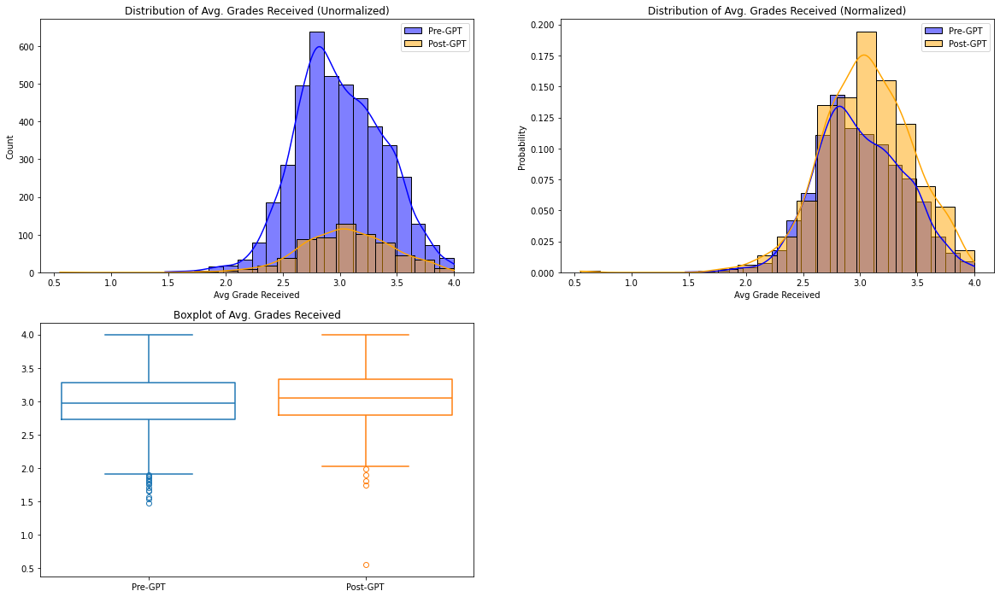
The histogram suggests that the distribution of average grades received during pre-GPT era slightly skew positive while the distribution of average grades received during post-GPT era is almost symmetric. Although there is some differences between these two distributions but it is possible due to either variance and/or the lack of data from post-GPT era. The boxplot also suggests that the 25th percentile, 50th percentile and 75th percentile are almost the same. The main difference is that pre-GPT era has a heavier tail on the left.

The test statistics are shown as follows:
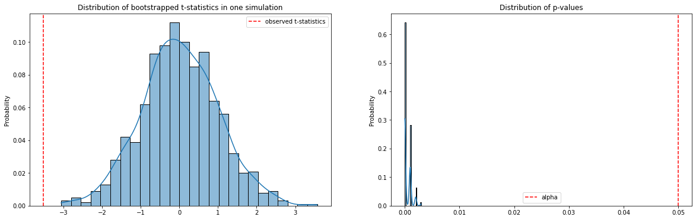
The test statistics however suggests that these two distributions are unlikely to have the same mean. Although the distribution of bootstrapped t-values are relatively close to observed t-values, all p-values are smaller than the significance level. We reject the null hypothesis in this case.

### Lower Division Written Based Arts Courses
The distribution of grades is as follows:
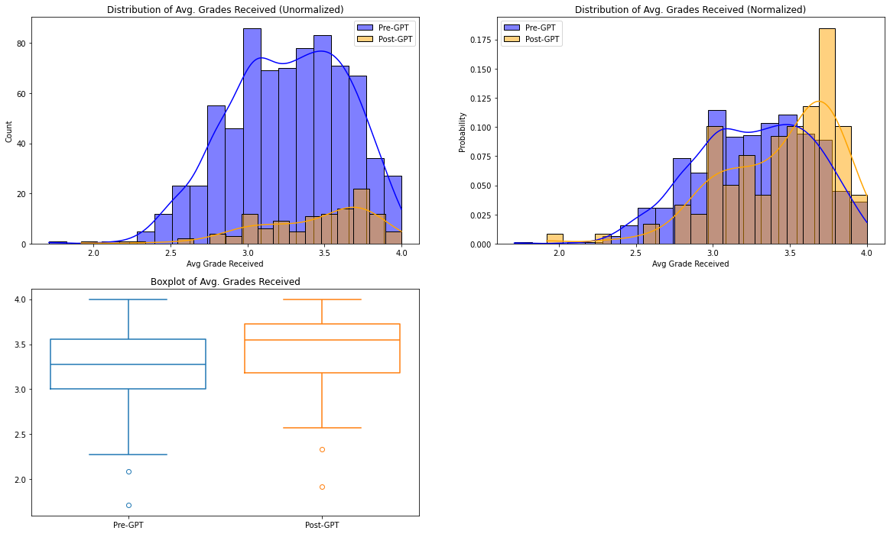
The histogram clearly shows a shift towards the higher end during post-GPT era. The histogram of post-GPT era has a sharp spike at around 3.8 while the histogram of pre-GPT era is almost flat from 3.0 to 3.8. The box plot also suggest a significant shift in 25th percentile, 50th percentile and 75th percentile.

The test statistics are shown as follows:
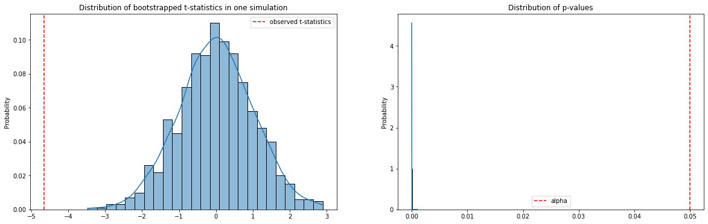
Clearly most p-values are 0, there might be some of the p-values hitting 0.002 or 0.003, but still, we reject the null.

### Lower Division Audio/Video Based Arts Courses
The distribution of grades is as follows:
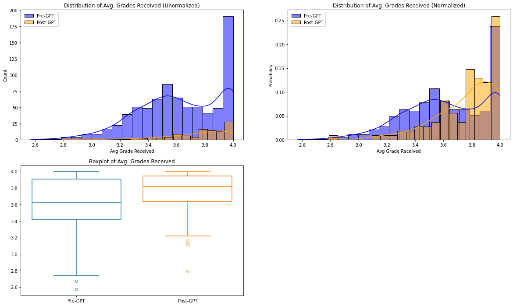
Note that the distribution seems to violate the assumption of normality. Both the distribution of pre-GPT era and post-GPT era have a spike at around 3.9~4.0. This might affect the statistical power and/or make the result invalid.

According to the plots, it should be clear that there is a shift in the average grade received. The box plot shows that even though 75th percentil is close, both the median and 25th percentile become significantly higher in post-GPT era. Additionally, the histogram also shows that in post-GPT era, the average GPA tends to be equal or higher than 3.8

The test statistics are shown as follows:
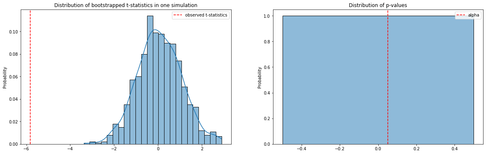
The plot on the left shows the distribution of bootstrapped t-values are far from the observed t-value, indicating how extreme it is to obtain current distribution under null hypothesis. The histogram of p-values is a weird behavior of `seaborn`, it indicates that among 1000 simulations, all obtained p-values are 0, so clearly we reject the null.

### Upper Division Abstract STEM Courses
The distribution of grades is as follows:
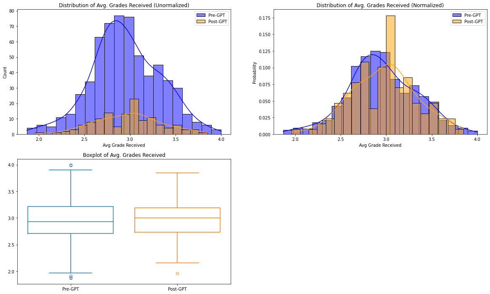
The histogram shows that the distribution of grades are close to the normal distribution in this group. For the post-GPT era, there is a spike around 3.1~3.2 but also a valley around 2.7~2.8. Most likely this spike and valley is because of the lack of data, but in general, they share almost the same distribution. The box plot suggests the same idea except that post-GPT era has a slightly higher 50th percentile which should be resulted from the spike and valley, and the range of post-GPT grades is smaller than that of pre-GPT era which also supports the lack of data guess.

The test statistics are shown as follows:
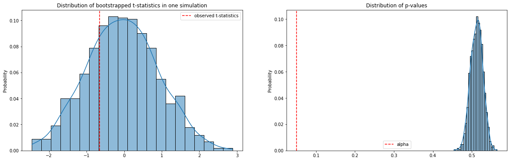
The distribution of p-values also supports the analysis above. Clearly we fail to reject the null. Clearly, GPT has no idea how to handle inquiries that require logic and/or ability to understand abstract math concepts.

### Upper Division Non-Abstract STEM Courses
The distribution of grades is as follows:
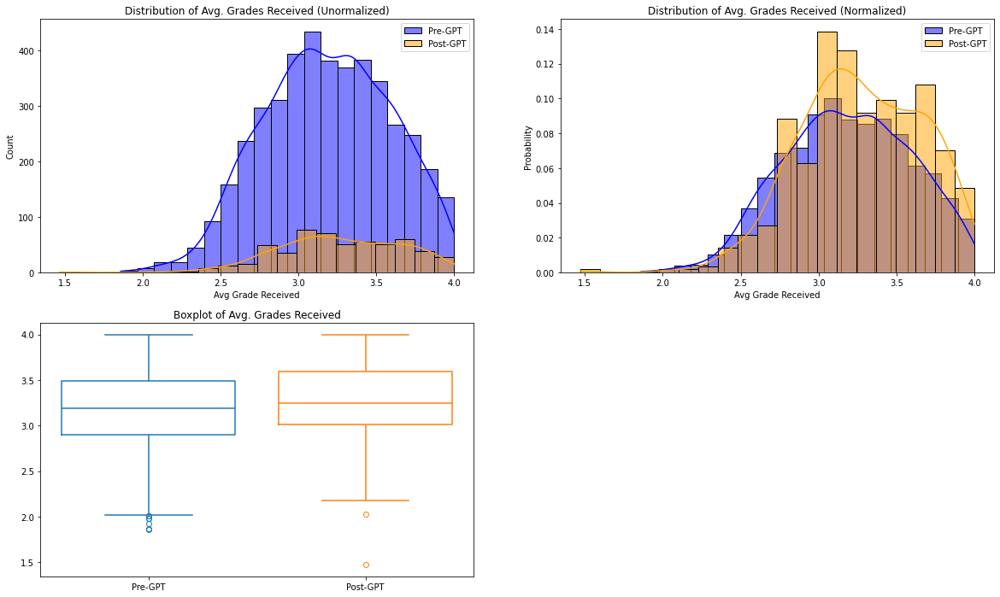
The histogram seems to suggests that pre-GPT era and post-GPT era almost shares the same distribution except that the post-GPT era slightly shift towards negative skew. The boxplot suggest that they almost share the same 50th percentile but post-GPT era has higer 25th percentile and 75th percentile. Additionally, the box plot also suggests that post-GPT era has a ligher left tail but a extremely low GPA at around 1.5.

The test statistics are shown as follows:
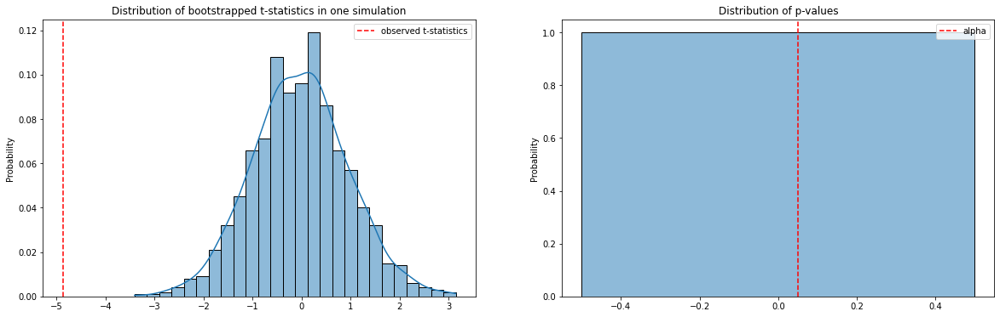
Note that the histogram of p-values is a weird behavior of `seaborn`, it indicates that among 1000 simulations, all p-values are 0. The relatively small gap between observed t-value and distribution of bootstrapped t-values indicates that it might not be too extreme to observe current distribution under null hypothesis, which suggests that the help of GPT is limited. However, we still need to reject the null hypothesis given the p-values and admits that GPT does affect the score.

### Upper Division Written Based Arts Courses
The distribution of grades is as follows:
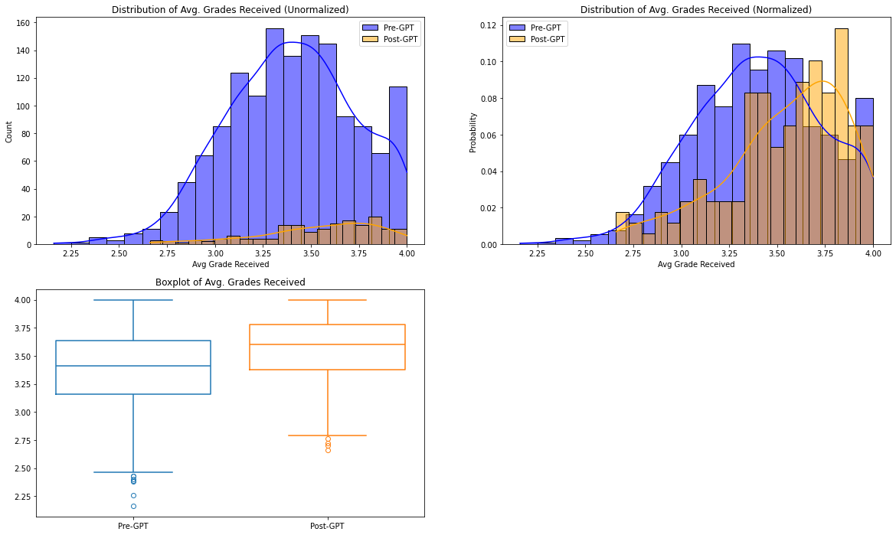
According to the histogram, the distribution of grades in pre-GPT era is mostly bell-shape except for a small spike at around 3.9~4.0. The distribution of grades in post-GPT era is heavily skewed. Additionally, their center are also not the same. The boxplot also suggests the similar result. The 25th percentile, 50th percentile and 75th percentile of post-GPT era are higher than that of pre-GPT era. Most likely they don't share the same mean.

The test statistics are shown as follows:
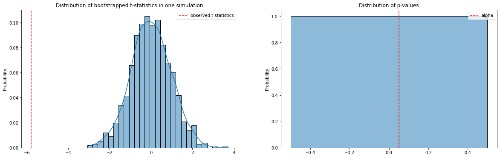
Note that the histogram of p-values is a weird behavior of `seaborn`, it indicates that among 1000 simulations, all p-values are 0. It is clear that we need to reject the null. 

### Upper Division Audio/Video Based Arts Courses
The distribution of grades is as follows:
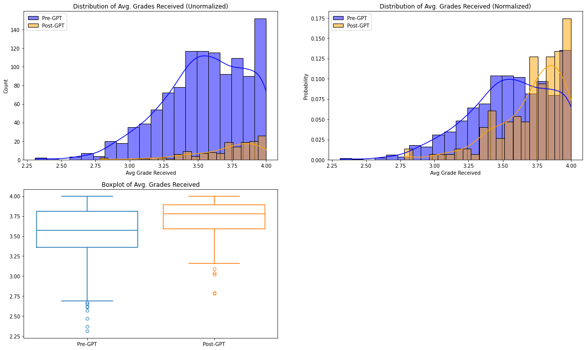
Note that the distribution seems to violate the assumption of normality. Both the distribution of pre-GPT era and post-GPT era do not give a bell-shape like kde curve. This might affect the statistical power and/or make the result invalid.

The histogram suggests that both pre-GPT era and post-GPT era have a spike at around 4.0. However, pre-GPT era suffers a much heavier tail on the left which should make its mean lower than that of post-GPT era. The boxplot also suggests such kind of shift. The 0th percentile, 25th percentile, 50th percentile, and 75th percentile of post-GPT era are significantly higher than that of pre-GPT era.

The test statistics are shown as follows:
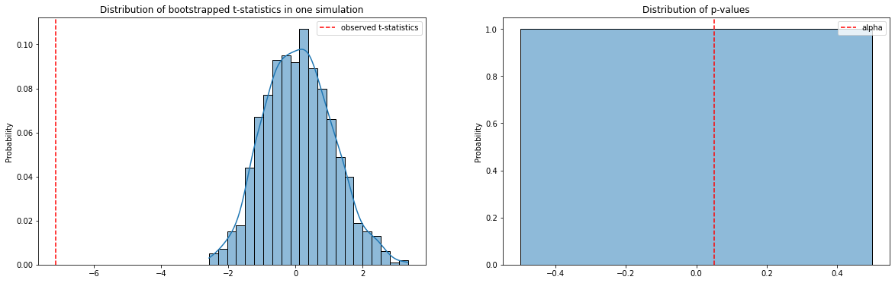
Note that the histogram of p-values is a weird behavior of `seaborn`, it indicates that among 1000 simulations, all p-values are 0. We reject the null.

## Analysis
### STEM Courses and Arts Courses in General
Unfortunately, among our intial hypothesis, only one of them remains true ---- upper division abstract STEM courses seem not to be affected by the introduction of GPT. However, the gap between bootstrappe t-values and observed t-values of STEM courses is smaller than that of Arts courses. This might suggest that the impact of GPT on STEM courses are somehow smaller than that on Arts courses, which alligns with our initial hypothesis in some ways.

### Arts Written Based Courses and Arts Video/Audio Based Courses
An interesting finding we have is that the distribution of bootstrapped t-values seem to suggest that it is more extreme for video/audio based courses to see such distribution under null hypothesis. This suggests that it is easier for GPT to help students to achieve a better score in video/audio based courses than that in written based courses. This is on the exact opposite side of our initial hypothesis.

This might be because written based Arts courses require to cite many materials properly to achieve a higher score but GPT might not be good at it (i.e. causing long-term dependency problems), while audio/video based courses does not put such emphasis on writing skills. Students might choose to write down some of their feelings and/or use their own words to describe the audio/video such that GPT can assist them on the writing part. There might be some other reasons as described below.

### Audio/Video Based Course In general
Another interesting finding we have is that the distribution of grades of audio/video based courses is always not a normal distribution. For lower division courses, at leaset we have a bell-shape like structure except for the spike at around 4.0. However, for upper division courses, there is no clear trend for a bell-shape curve. We do not know why this happens. A possible guess is these courses, especially upper division courses, are heavily based on interactions between students and professors. In other words, as long as students are willing to attend lectures/labs and/or talk to professors, professor will tend to give high scores. (i.e. these courses are not primarily based on assignments and exams) However, please be aware that we do not know exactly how these courses are taught. This is just a guess.

## Limitations
Due to the limit of time and group members, we only collect data from courses that under some representative departments, resulting in the limited amount of data in post-GPT era. Moreover, we are also suspecting that there are some other parameters affecting the result, for example, professors. (i.e. teaching style) A block design might be able to identify these additional parameters.

Though upper division abstract STEM courses suggests that this might not be the case, it is still possible that there is actually some trend in the overal GPA across either department, or the school. We might need some special ways to either identify this effect, and/or cancel out this effect.

## Conclusion
The analysis results indicate that only high-level abstract STEM courses remain unaffected by the introduction of GPT. GPT is more likely to help students achieve better scores in video/audio-based courses than in written courses. Although student course grades are influenced by many uncontrollable factors and the analysis results are only a reference, the integration of generative AI tools like ChatGPT brings both opportunities and challenges to higher education. This study emphasizes the necessity of balanced methods using these technologies to enhance, not replace, traditional learning methods. This approach can fully utilize the potential of AI, enrich educational experiences, and better prepare students for the complexity of the modern world.

## Appendix
### Data Description
#### Features
CAPE provides following features:
- Instructor: *Name of the instructor*
- Course: *Name of the course,*
- Term: *In which term the course is held*
- Enroll: *Number of students enrolled*
- Evals Made: *Number of evaluations made (does not affect Avg Grade Expected)*
- Rcmnd Class: *Proportion of students who recommend class*
- Rcmnd Instr: *Proportion of students who recommend instructor*
- Study Hrs/wk: *Study hours per week*
- Avg Grade Expected: *Expected average grade (among evaluations made)*
- Avg Grade Received: *Actual average grade (among all students)*

As described in the preprocess section, we introduced following new features to our dataset:
- isPreGPT: *Inidicating if the course is taught before ChatGPT is introduced*
- isUD: *Indicating if the course is an upper-division course*
- isSTEM: *Indicating if the course is a STEM course*
- isAbstract: *The course is either proof based or focusing on abstract concepts that GPT is not good at (valid if `isSTEM=True`)*
- isWritten: *The course is mainly based on written materials instead of audio/video (valid if `isSTEM=False`)*

#### Number of Samples
Before preprocessing, there are 23363 samples. 8255 samples are from Arts courses and 15108 samples are from STEM courses.

After preprocess, there are 15463 samples. 4648 samples are from Arts courses and 10815 samples are from STEM courses. 13571 samples are tagged as "pre-GPT" and 1892 samples are tagged as "post-GPT."

Among 4648 samples from Arts courses, 2462 courses are tagged as "written based" and 2186 courses are tagged as not.

Among 10815 samples from STEM courses, 806 courses are tagged as "abstract" and 10805 courses are tagged as not.

#### Courses Identified as Abstract
MATH 100A, MATH 100B, MATH 100C,  
MATH 103A, MATH 103B, MATH 104A, 
MATH 104B, MATH 105, MATH 106, 
MATH 109, MATH 120A, MATH 120B, 
MATH 140A, MATH 140B, MATH 140C, 
MATH 142A, MATH 142B, MATH 144, 
MATH 146, MATH 148, MATH 150A, 
MATH 150B, MATH 154, MATH 158, 
MATH 160A, MATH 160B, MATH 182, 
MATH 190A, MATH 190B, MATH 191, 
CSE 20, CSE 105, CSE 106, 
CSE 107, CSE 130, CSE 132A, 
CSE 140, CSE 150A, CSE 160, 
PHYS 130A, PHYS 130B, PHYS 130C, 
PHYS 137

#### Courses Identified as Video/Audio Based
All courses in visual arts (VIS) and music (MUS) department.

### Usage of LLM
We craft part of the UCSD catalog information into the following prompt:
> Abstract courses are defined as courses that are either proof-based or focusing on abstract concepts. Please go over the following catalog and identify which courses are abstract: 
> \### 
> \<catalog> 
> \### 
> Please take a deep breath and explain your choice.

The prompt is then sent to ChatGPT-3. In order to avoid dependency issues, the length of each request is controlled to be under 700 words. (i.e. roughly lower than 1000 tokens) The result will be reviewed by human to make sure there is no false positive. However, please be aware that there might still be false negatives. (i.e. abstract courses might be classified as non-abstract courses)

### Bootstrapped Two-sampled T-test
The bootstrapped two-sampled t-test is defined as follows:
1. Find the t-statistic on the original data
2. Mix the data together
3. Perform bootstrapping on the mixture of data. The parameter of interest is mean
4. Find the t-statistic on the bootstrapped result
5. Repeat step 3 and 4 for desired number of times
6. Find the p-value using following formula:
    $$
    \frac{\text{number of (bootstrapped t-statistic > original t-statistics)}}{\text{number of trails}}
    $$
Note that only the first step might need Welch's t-test depending on the data. Additionally, if we are doing a two-sided test, we need to use absolute value of obsered t-statistics and bootstrapped t-statistics instead of their original value.

This method is inspired by Algorithm 16.1 described in Chapter 16 of An Introduction to the Bootstrap by Bradley Efron and Robert J. Tibshirani. The original algorithm is defined as follows:
1. Draw $B$ samples of size $n+m$ with replacement from $x$. Call the first $n$ observations $z^*$ and the remaining $m$ observations $y^*$
2. Evaluate $t(\cdot)$ on each sample,
    $$
    t(x^{*b})=\bar z^* - \bar y^*,\ \ b\in\{1,2,..., B\}
    $$
3. Approximate $\text{ASL}_{\text{boot}}$ by
    $$
    \widehat{\text{ASL}}_{\text{boot}} = \#\{t(x^{*b})\geq t_{obs})\}/B
    $$
    where $t_{obs}$ is the observed value of the statistic

Although the proposed bootstrapped two-sampled t-test keeps the structure proposed by Bradley and Robert, it is still hard for us to justify why mixing data with different variance and treat the new mixed data as equal variance works (i.e. step 3 and step 4). Moreover, it can be explained via intuition why using an absolute value indicates a two-sided test and using original value indicates a one-sided test, but it is hard for us to justify why that is the case mathematically. However, it is possible for us to demonstrate the distribution of p-values under null hypothesis is indeed $\text{Uniform}(0,1)$ via simulation.

#### Simulation 1 Setup
We set the seed of `numpy` random number generator to be 42. For each simulation, we sample 30 samples from $N(0,1)$ as $\textbf{x}$ and 300 samples from $N(0,1)$ as $\textbf{y}$. Absolute values are used to demonstrate a two-sided test. The null hypothesis is:
$$
H_0: \bar{\textbf{x}}=\bar{\textbf{y}}
$$
Bootstrapping process is repeated for 1000 times for each simulation. After 1000 simulations, the distribution of $p-values$ is shown below:
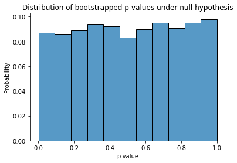

#### Simulation 2 Setup
We set the seed of `numpy` random number generator to be 42. For each simulation, we sample 30 samples from $N(0,1)$ as $\textbf{x}$ and 300 samples from $N(0,16)$ as $\textbf{y}$. Absolute values are used to demonstrate a two-sided test. The null hypothesis is:
$$
H_0: \bar{\textbf{x}}=\bar{\textbf{y}}
$$
Bootstrapping process is repeated for 1000 times for each simulation. After 1000 simulations, the distribution of $p-values$ is shown below:
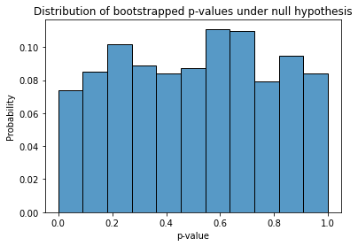

#### Simulation 3 Setup
We set the seed of `numpy` random number generator to be 42. For each simulation, we sample 30 samples from $N(0,1)$ as $\textbf{x}$ and 300 samples from $N(0,1)$ as $\textbf{y}$. Absolute values are ***not*** used to demonstrate a one-sided test. The null hypothesis is:
$$
H_0: \bar{\textbf{x}}=\bar{\textbf{y}}
$$
Bootstrapping process is repeated for 1000 times for each simulation. After 1000 simulations, the distribution of $p-values$ is shown below:
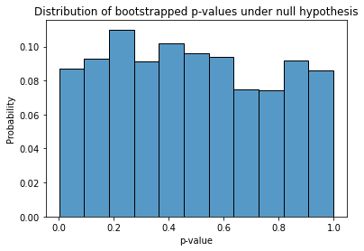
